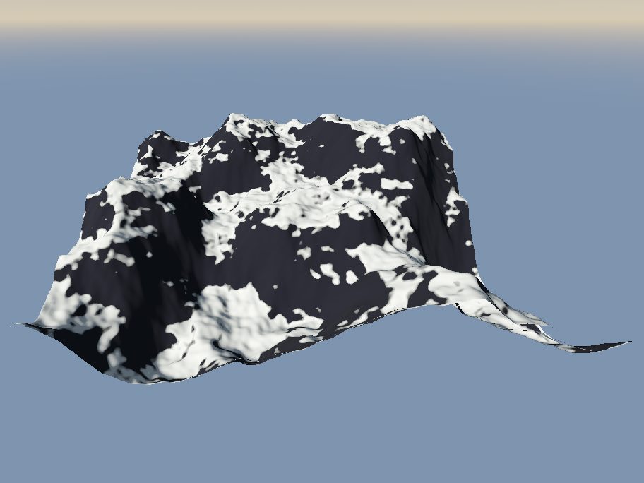
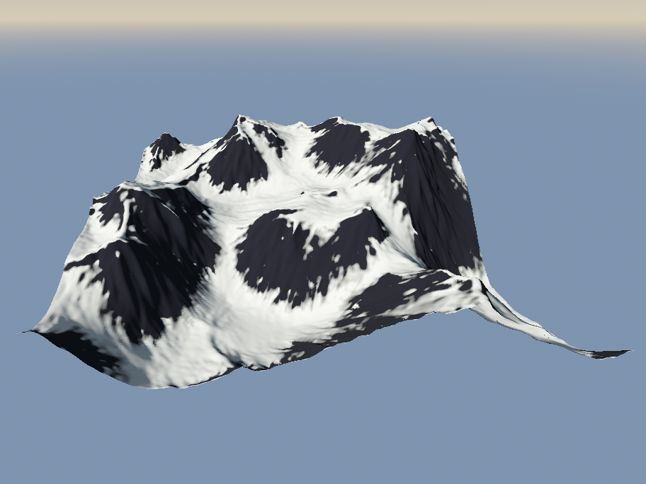
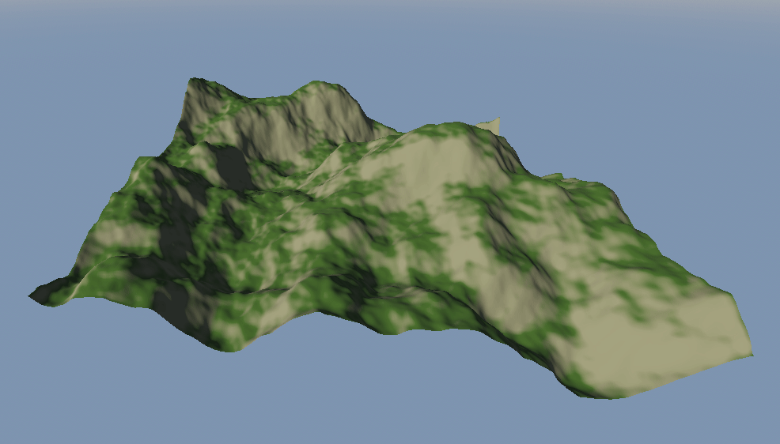
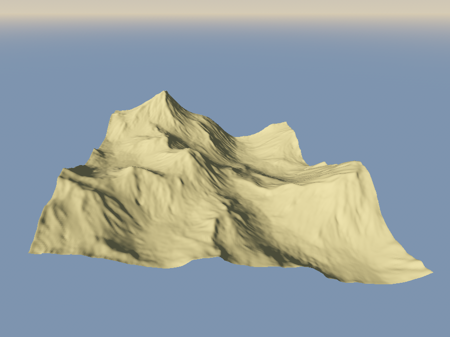
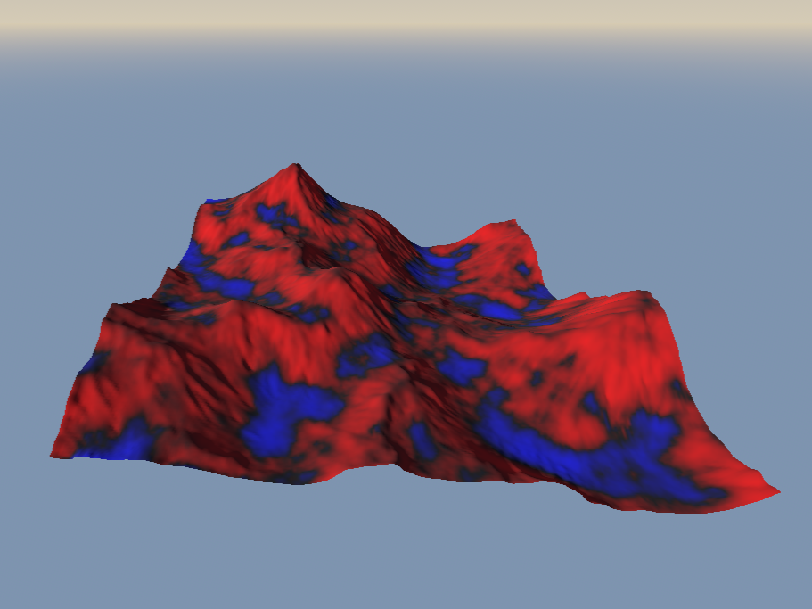

# Erosion Simulator

A Godot 4 project for simulating terrain erosion using compute shaders.
Its very inspired by the video by sebastian lague

## Features

- Procedural terrain generation using FastNoiseLite
- Hydraulic erosion
- Thermal erosion 
- Erosion heatmap visualization (see where erosion and deposition occured)
- UI for adjusting noise and erosion parameters
- Export heightmaps as PNG images

## Gallery

**Before Erosion**  

**After Erosion**  

**Erosion Animation**  
 

**Eroded Heightmap**  

**Erosion Heatmap**  

## Planned Features

- **Wind erosion** (once i figure it out)

## Why?

I made this to learn compute shaders.
It’s open source feel free to use, modify, or contribute.

## How to Use

1. Clone or download this repository.
2. Open the project in [Godot 4](https://godotengine.org/).
3. Run the main scene to start experimenting.

## License

MIT License